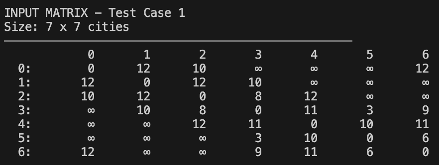
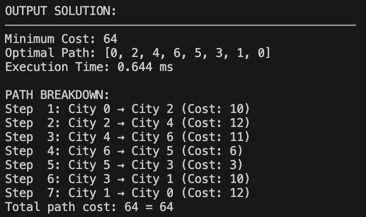

# Tugas Tantangan Strategi Algoritma - Penyelesaian Travelling Salesman Problem (TSP) dengan Dynamic Programming

### 📝 Deskripsi Program
Program ini mengimplementasikan solusi **Travelling Salesman Problem (TSP)** menggunakan **Dynamic Programming** dengan algoritma **Held-Karp**. TSP adalah masalah optimisasi untuk menemukan rute terpendek yang mengunjungi semua kota tepat sekali dan kembali ke kota asal.

### 🔬 Algoritma Dynamic Programming
Program menggunakan pendekatan **Held-Karp algorithm** yang merupakan solusi DP optimal untuk TSP dengan kompleksitas:
- **Time Complexity**: O(n² × 2ⁿ)
- **Space Complexity**: O(n × 2ⁿ)

#### Implementasi DP:
1. **State Definition**: 
   - `dp[mask][i]` = minimum cost untuk mengunjungi semua kota dalam bitmask dan berakhir di kota `i`
   - `mask` adalah representasi subset kota yang sudah dikunjungi

2. **Base Case**: 
   - `dp[1][0] = 0` (mulai dari kota 0 dengan cost 0)

3. **State Transition**:
   ```rust
   for mask in 0..(1 << n) {
       for i in 0..n {
           if (mask & (1 << i)) != 0 {
               let old_mask = mask ^ (1 << i);
               for j in 0..n {
                   if (mask & (1 << j)) != 0 {
                       let cost = dp[old_mask][j] + matrix[j][i];
                       if cost < dp[mask][i] {
                           dp[mask][i] = cost;
                           pre[mask][i] = j as i32;
                       }
                   }
               }
           }
       }
   }
   ```

4. **Path Reconstruction**: Menggunakan array `pre` untuk merekonstruksi jalur optimal

### 🖼️ Screenshot Program

#### Input:


#### Output:


### 🚀 Cara Menjalankan Program

#### Prerequisites:
- **Rust** (versi 1.70 atau lebih baru)
- **Cargo** (package manager Rust)

#### Instalasi Rust:
```bash
# macOS/Linux
curl --proto '=https' --tlsv1.2 -sSf https://sh.rustup.rs | sh

# Windows
# Download dari https://rustup.rs/
```

#### Menjalankan Program:
```bash
# Clone repository
git clone <repository-url>

# Compile dan jalankan
cargo run
```

### 📁 Struktur Project
```
tugas_tantangan_stima/
├── src/
│   ├── main.rs          # Program utama
│   └── test.rs          # Test cases dan matrix data
├── screenshot/
│   ├── input.png        # Screenshot input
│   └── output.png       # Screenshot output
├── Cargo.toml           # Konfigurasi Rust
└── README.md            # Dokumentasi
```

### 🧏🏻‍♂️ Pembuat
- **Nama**: Alvin Christopher Santausa
- **NIM**: 13523033
- **Mata Kuliah**: Strategi Algoritma